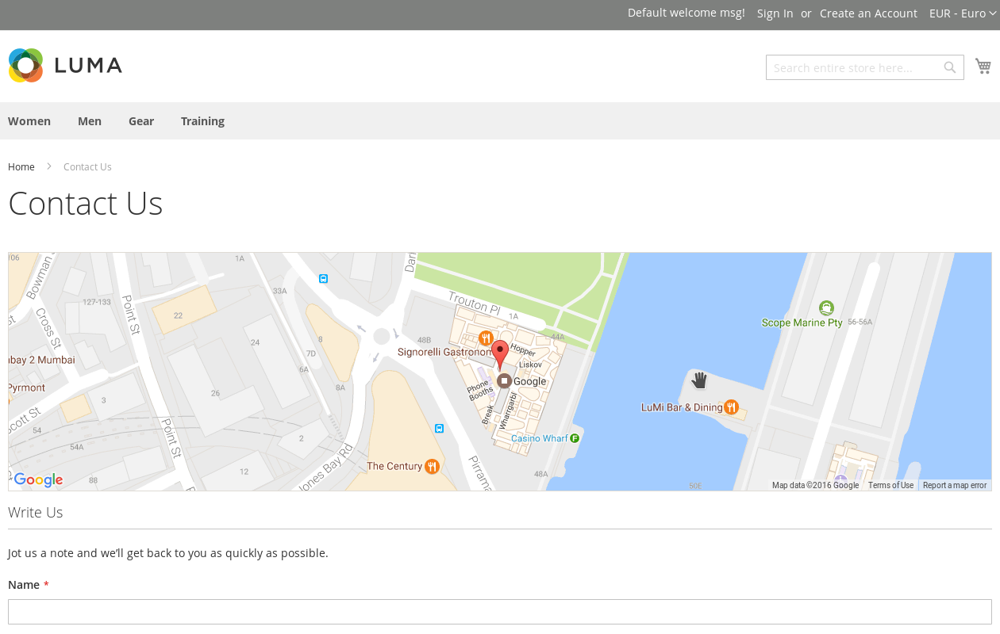
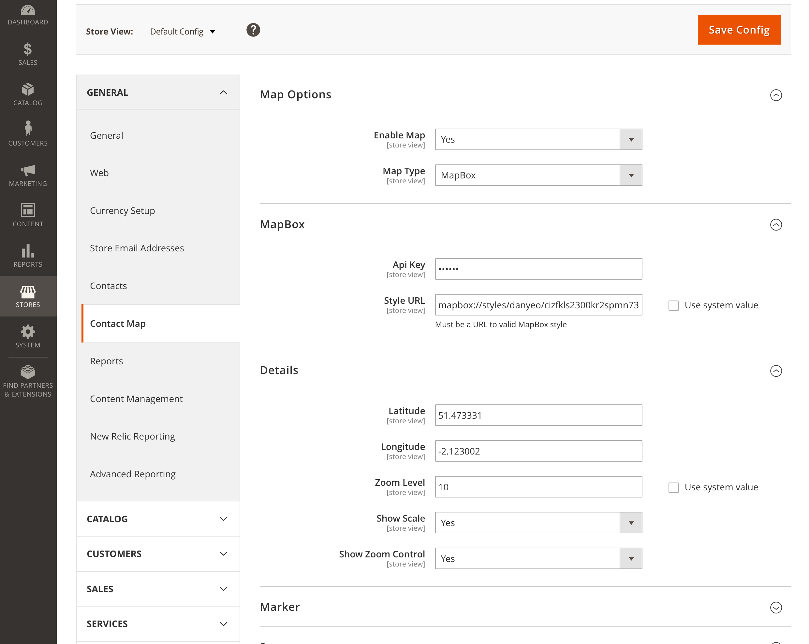

# Magento2 Contact Map

Extension will assist in adding company or store coordinates with maps directly to the contact us page.

### Contact Us Page



### Configuration



## Install with Composer as you go

1. Go to Magento2 root folder

2. Add the following to your `composer.json` file:

    ```json
    "repositories": [
        ...
        {
            "type": "vcs",
            "url": "https://github.com/GreenImp/m2.ContactMap"
        }
        ...
    ]
    ```

3. Enter following commands to install module:

    ```bash
    composer require faonni/module-contact-map
    ```
   Wait while dependencies are updated.

4. Enter following commands to enable module:

    ```bash
	php bin/magento setup:upgrade
	php bin/magento setup:static-content:deploy
    ```
